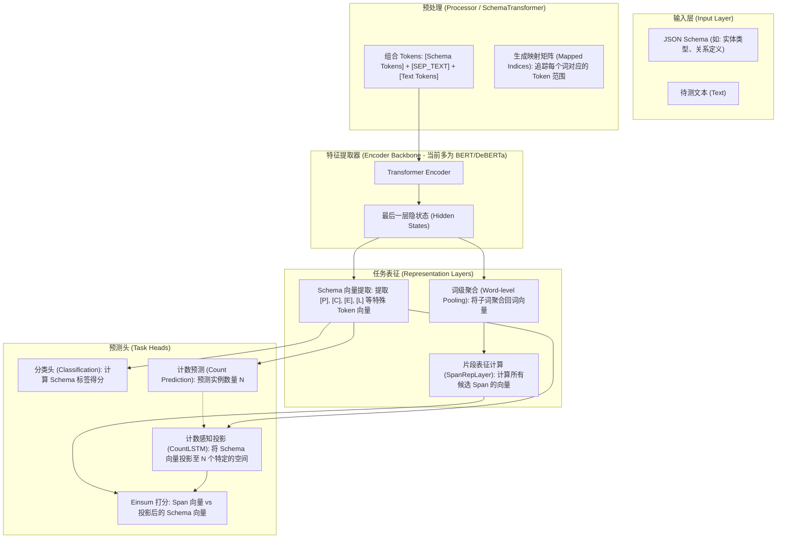

  - gliner2/model.py
      - 这里加载 backbone（AutoModel）、取 hidden_size，并初始化 head（span/classifier/count）。换 Qwen3 时主要改这里（加载方式/配置/可能的 pad 处理）。
  - gliner2/processor.py
      - 这里加载 tokenizer、添加 special tokens、做 subword 映射与 pooling。换 Qwen3 tokenizer 时需要调整（例如 pad_token、tokenize 兼容、特殊符号扩展）。
  - gliner2/training/trainer.py
      - 训练配置与冻结策略；如果 Qwen3 规模/梯度策略不同，需要调整 lr、batch、warmup 或冻结逻辑。
  - gliner2/training/lora.py
      - LoRA target module 名称目前匹配 query/key/value/dense，Qwen3 通常是 q_proj/k_proj/v_proj/o_proj 或类似命名，需适配。
  - tests/test_entity_extraction.py
  - tests/test_relation_extraction.py
  - tests/test_structure_extraction.py
      - 示例里直接加载 fastino/gliner2-*，换 backbone 后要更新模型名/加载方式。
  - README.md 与 tutorial/*.md
      - 示例/模型名/训练说明需要更新，避免文档和实际不一致。

  当前项目的 head 是什么？
  在 gliner2/model.py 内，head 由以下几块组成：

  - Span/Structure 相关：SpanRepLayer + CountLSTM*（count_embed）+ count_pred
  - Classification 相关：classifier（MLP）
  - 它们都是基于 hidden_size 的通用 MLP/Span 表达层，不依赖特定 backbone 的 token_type/CLS。

  backbone 如何兼容 head？

  - 需要的最小兼容条件是：
      - encoder 输出 last_hidden_state，形状 (batch, seq_len, hidden)；
      - 提供 config.hidden_size（用于初始化 head）；
      - tokenizer 支持 tokenize()、convert_tokens_to_ids()，并能添加 SPECIAL_TOKENS（[P], [C], [E], [R], [L], [SEP_*] 等）。
  - 兼容关键点：
      - gliner2/model.py 里 head 的 input_dim = encoder.config.hidden_size，只要 hidden size 对齐即可自动适配。
      - gliner2/processor.py 通过 tokenizer 切分 schema/token，并用 token_pooling 聚合子词到词级表示；因此 tokenizer 的 subword 行为必须稳定。
      - 如果 Qwen3 tokenizer 没有 pad_token（常见于 decoder-only），建议在 gliner2/processor.py 或模型加载处设置 tokenizer.pad_token = tokenizer.eos_token，避免 batch
        padding 出错。